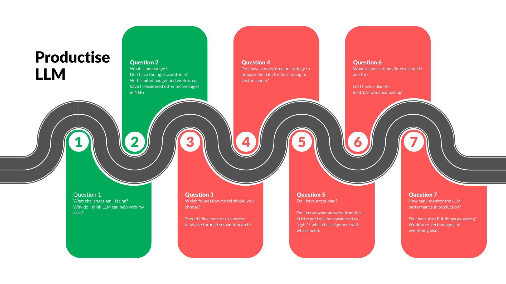

# Awesome LLM Productization

---

What can a Large Language Model (LLM) do? 

Well, imagine LLM as your ultimate personal assistant, equipped with not just an extensive library of knowledge but also the ability to reason, think creatively, and access a toolbox of skills and experiences from across the world. It's like having a supercharged, all-knowing sidekick by your side, ready to assist you with any task, answer any question, and solve any problem, all while adapting to your needs and preferences seamlessly. LLM is your digital oracle, your genie in the lamp, always at the ready to help you unlock the vast potential of human understanding and ingenuity.

However, for your ultimate personal assistant to truly function well, it must be adaptable to your unique circumstances, whether it involves manageing your daily tasks and gathering information or addressing the specific business needs of your company.

In ths repo, we will monitor projects or packages that can help you speed up the adoption, we will then start to look at relevant use cases so that we can put those into action.

As far as we concern, the challenges in deploying LLMs are actually not that special. Three things rises:

1. Finetuning process, especially the process of training data;
2. Alignment, making sure LLMs produces what are needed, which can be regarded as the adoption of specific business logic;
3. Deployment of the finetuned LLMs, this is trying to find a balance between cost and performance.

As a result, we will focus this repo to elciit any process or tools that can help you nagivate the three aspects. 

## Table of Contents
- [Awesome-LLM-Productization](#awesome-llm-productization)
  - [The Survey Paper](#the-survey-paper)
  - [News, Papers & Startups](#for-news-research-papers-and-startups)
  - [How to Contribute](#how-to-contribute)
  - [Models and Tools](#models-and-tools)
    - [Open LLM Models](#open-llm-models)
    - [Full LLM Lifecycle](#full-llm-lifecycle)
    - [LLM Prompt Management](#llm-prompt-management)
    - [LLM Finetuning](#llm-finetuning)
    - [Embeddings](#embeddings)
    - [Vector Store](#vector-store)
    - [LLM Deployment](#llm-deployment)
    - [LLM Boilerplate](#llm-boilerplate)
    - [LLM Monitoring](#llm-monitoring)
    - [Use Cases](#use-cases)
    - [General MLOps Tools](#general-mlops-tools)
  - [Regulations](#regulations)
  - [Contact](#contact)

## The Survey Paper

If you just start your LLM journey, try this survey paper so that you can be comfortable with some terminalogies: https://arxiv.org/abs/2303.18223 or check out their repo: https://github.com/RUCAIBox/LLMSurvey.

There is also a reading list that can be a good starting point from veekaybee: [Anti-hype LLM reading list](https://gist.github.com/veekaybee/be375ab33085102f9027853128dc5f0e)

## For News, Research Papers and Startups

We have a free internal website to trace news on AI, research papers and startups claiming to use AI for business needs, if you want to have access, please email: opensource@oscinis.com. Hopefully we can help you find ideas of your use cases, business needs and ideas. 

## How to Contribute
Contribute through opening issues. For instance, you can report new package, libraries, tools or businesses/startups to add to our list. 

## Models and Tools

### Open LLM Models
* [ChatGLM-6B](https://github.com/THUDM/ChatGLM-6B) - an open bilingual language model based on General Language Model (GLM) framework, with 6.2 billion parameters. (Note from the repo: a small LM to start with so that you can have a taste on prompting & finetuning. You can use a comemrcial grade graphics card with only 8GB to successfully fine tune it without any other financial commitment. You can use it like it is a BERT.)
* [OpenLLM Leaderboard](https://huggingface.co/spaces/HuggingFaceH4/open_llm_leaderboard) - https://huggingface.co/spaces/HuggingFaceH4/open_llm_leaderboard. (Note from the repo: a good place for you to have a list of avaialble open LLMs, be careful about their comercial terms)
* [MiniGPT-4](https://github.com/Vision-CAIR/MiniGPT-4) - Enhancing Vision-language Understanding with Advanced Large Language Models 
* [LLaVA](https://github.com/haotian-liu/LLaVA) - Visual instruction tuning towards large language and vision models with GPT-4 level capabilities
* [VisualGLM-6B](https://github.com/THUDM/VisualGLM-6B) - VisualGLM-6B is an open-source, multi-modal dialog language model that supports images, Chinese, and English. 

### Full LLM Lifecycle

* [EasyLM](https://github.com/young-geng/EasyLM) - EasyLM is a one stop solution for pre-training, finetuning, evaluating and serving LLMs in JAX/Flax. (Note from the repo: here comes the details of [Jax](https://github.com/google/jax) and [Flax](https://github.com/google/flax))
* [Jina](https://github.com/jina-ai/jina) - Jina lets you build multimodal AI services and pipelines that communicate via gRPC, HTTP and WebSockets, then scale them up and deploy to production

### LLM Prompt Management
* [Pezzo](https://github.com/pezzolabs/pezzo) - Open-source, developer-first LLMOps platform designed to streamline prompt design, version management, instant delivery, collaboration, troubleshooting, observability and more.

### LLM Finetuning
* [trl](https://github.com/lvwerra/trl) - a full stack library where we provide a set of tools to train transformer language models and stable diffusion models with Reinforcement Learning;
* [P-tuning v2](https://github.com/THUDM/P-tuning-v2) - An optimized prompt tuning strategy achieving comparable performance to fine-tuning on small/medium-sized models and sequence tagging challenges;
* [QLoRA](https://github.com/artidoro/qlora) - An efficient finetuning approach that reduces memory usage (Note from the repo: good for smaller dataset finetuning);
* [LLM QLoRA](https://github.com/georgesung/llm_qlora) - Fine-tuning LLMs using QLoRA 
* [Prompt2Model](https://github.com/neulab/prompt2model) - Generate Deployable Models from Instructions

### Embeddings

* [clip-as-service](https://github.com/jina-ai/clip-as-service) - a low-latency high-scalability service for embedding images and text. It can be easily integrated as a microservice into neural search solutions (Python based, Apache 2);
* [text-embeddings-inference](https://github.com/huggingface/text-embeddings-inference) - a toolkit for deploying and serving open source text embeddings and sequence classification models, enabling high-performance extraction for the most popular models, including FlagEmbedding, Ember, GTE and E5 (Rust based; Apache 2);
* [infinity](https://github.com/michaelfeil/infinity) - a high-throughput, low-latency REST API for serving vector embeddings, supporting a wide range of text-embedding models and frameworks (Python based, MIT);

### Vector Store
> All open source. And you will find those tools are mostly Java, Go, Python or Rust based 

* [ElasticSearch](https://github.com/elastic/elasticsearch) - a distributed, RESTful search engine optimized for speed and relevance on production-scale workloads (Java based)
* [pgvector](https://github.com/pgvector/pgvector) - Open-source vector similarity search for Postgres (C based)
* [Weaviate](https://github.com/weaviate/weaviate) - an open source vector database that stores both objects and vectors (Go based)
* [Milvus](https://github.com/milvus-io/milvus) - an open-source vector database built to power embedding similarity search and AI applications (Go based)
* [gensim](https://github.com/RaRe-Technologies/gensim) - a Python library for topic modelling, document indexing and similarity retrieval with large corpora (Python based)
* [txtai](https://github.com/neuml/txtai) - All-in-one open-source embeddings database for semantic search, LLM orchestration and language model workflows (Python based)
* [Qdrant](https://github.com/qdrant/qdrant) - High-performance, massive-scale Vector Database for the next generation of AI.(Rust Based)
* [Marqo](https://github.com/marqo-ai/marqo) - Vector search for humans based on Opensearch. (Python based)
* [Vald](https://github.com/vdaas/vald) - A Highly Scalable Distributed Vector Search Engine (Go based)
*  - search, recommendation and personalization need to select a subset of data in a large corpus (Java based)
* [OpenSearch](https://github.com/opensearch-project/OpenSearch) - Open source distributed and RESTful search engine (Java based)
* [ChromaDB](https://github.com/chroma-core/chroma) - open-source embedding database (Python based - in-memory only at the moment)

### LLM Deployment
* [Ray Serve](https://github.com/ray-project/ray) - Ray Serve is a scalable model serving library for building online inference APIs (Note from the repo: from the [Ray]() project)
* [OpenLLM from BentoML](https://github.com/bentoml/OpenLLM) - an open-source platform designed to facilitate the deployment and operation of large language models (LLMs) in real-world applications.
* [Langfuse](https://github.com/langfuse/langfuse) - Open source observability and analytics for LLM applications 
* [text-generation-inference](https://github.com/huggingface/text-generation-inference) - A Rust, Python and gRPC server for text generation inference. Used in production at HuggingFace to power Hugging Chat, the Inference API and Inference Endpoint
* [vLLM](https://github.com/vllm-project/vllm) - A high-throughput and memory-efficient inference and serving engine for LLMs 
* [mlc-llm](https://github.com/mlc-ai/mlc-llm) - Enable everyone to develop, optimize and deploy AI models natively on everyone's devices. 
* [llm-awq](https://github.com/mit-han-lab/llm-awq) - Efficient and accurate low-bit weight quantization (INT3/4) for LLMs, supporting instruction-tuned models and multi-modal LMs.
* [streaming-llm](https://github.com/mit-han-lab/streaming-llm) - deploy LLMs for infinite-length inputs without sacrificing efficiency and performance.
* [llama2.c](https://github.com/trholding/llama2.c) - run LLMs on minimum hardware
* [Wordware](https://www.wordware.ai) - A web-hosted IDE where non-technical domain experts work with AI Engineers to build task-specific AI agents. It approaches prompting as a new programming language rather than low/no-code blocks.
* [text-generation-inference](https://github.com/huggingface/text-generation-inference) -  Large Language Model Text Generation Inference
* [TensorRT-LLM](https://github.com/NVIDIA/TensorRT-LLM) - an easy-to-use Python API to define Large Language Models (LLMs) and build TensorRT engines that contain state-of-the-art optimizations to perform inference efficiently on NVIDIA GPUs. 

### LLM Boilerplate
* [Zep](https://github.com/getzep/zep) - a fast, scalable building blocks for production LLM apps 
* [LlamaGPT](https://github.com/getumbrel/llama-gpt) - A self-hosted, offline, ChatGPT-like chatbot. 
* [Ollama](https://github.com/jmorganca/ollama) - Get up and running with Llama 2 and other large language models locally 

### LLM Monitoring
> Note, tools in this section are not necessarily just for LLMOps. They can be general tools for APM, Logs, etc.

* [OpenObserve](https://github.com/openobserve/openobserve) - OpenObserve is a cloud native observability platform built specifically for logs, metrics, traces and analytics designed to work at petabyte scale.
* [AuditNLG](https://github.com/salesforce/AuditNLG) - an open-source library that can help reduce the risks associated with using generative AI systems for language. The library supports three aspects of trust detection and improvement: Factualness, Safety, and Constraint.

### Use Cases
* [MetaGPT](https://github.com/geekan/MetaGPT) - The Multi-Agent Framework: Given one line Requirement, return PRD, Design, Tasks, Repo;
* [Doctor Dignity](https://github.com/llSourcell/Doctor-Dignity) - a Large Language Model that can pass the US Medical Licensing Exam

### General MLOps Tools

* [Awesome MLOps](https://github.com/kelvins/awesome-mlops) - A curated list of awesome MLOps tools
* [MLflow](https://github.com/mlflow/mlflow) - A Machine Learning Lifecycle Platform
* [dbt](https://www.getdbt.com/) - dbt enables data analysts and engineers to transform their data using the same practices that software engineers use to build applications.
* [dvc](https://github.com/iterative/dvc) - data and model versioning tool
* [ml-ops](https://ml-ops.org/) - Some good acticles on machine learning operations

## Regulations 

Coming

## Contact
Please feel free to open issues for any questions/comments you may have. You can also email opensource@oscinis.com if you prefer a more personal touch. 
